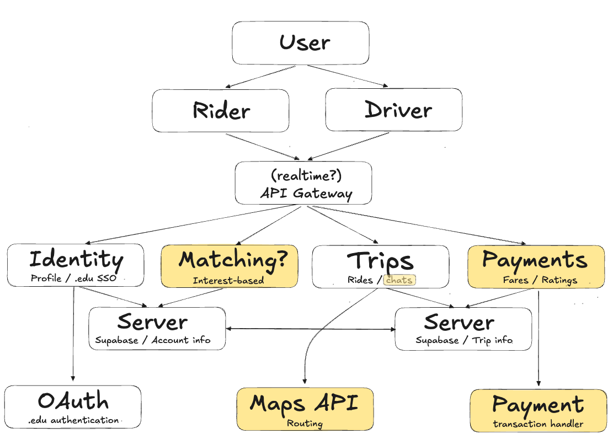

# Architecture

For the project's overall architecture, see the image below:

   
## App functionality

Lets users do the following:
- Signup/login using their .edu emails
- See available/upcoming trips and seat availability
- Request to join trips
- Post trips as a driver
- Accept/decline join requests
- Chat with the trip participants

### For UML diagrams, see:
- [how ride requests work](/public/ride-request.png)
- [how posting rides works](/public/ride-post.png)
- [how signups/logins work](/public/signup-login.png)
   
## External APIs

### Google's OAuth

- **Endpoint used:** [`/url`](placeholder)
  - Query params: `if applicable`
- **Rate limit:** TBD

### Google Maps API ?
- usage TBD

## Database Schema

Our SQL-based database is hosted on Supabase to securely store account information, trip information, and in anticipation of a chatting system.

### `users` table

| Field | Type | Description |
|---|---|---|
| `id` | INT (PRIMARY KEY) | Auto-incremented user ID |
| `first_name` | VARCHAR | User's first name |
| `last_name` | VARCHAR | User's last name |
| `email` | VARCHAR (UNIQUE) | Email associated with user |
| `school` | VARCHAR | School associated with user |
| `role` | VARCHAR | Whether user is a rider or driver |
| `profile_picture` | VARCHAR | Data for profile picture? |
| `rating` | FLOAT | User's rating as a rider/driver |
| `created_at` | TIMESTAMP | Time at which the user's account was created |

### `Trips` table

| Field | Type | Description |
|---|---|---|
| `id` | INT (PRIMARY KEY) | Auto-incremented Trip ID |
| `driver_id` | INT (FOREIGN KEY) | References the driving user's ID |
| `title` | VARCHAR | Title for the trip |
| `category` | VARCHAR | Type of trip |
| `destination` | VARCHAR | Trip's destination |
| `departure_time` | TIMESTAMP | Time of the trip's departure |
| `available_seats` | INT | Number of empty seats in the trip |
| `cost` | DECIMAL | Cost per trip passenger |
| `round_trip` | BOOLEAN | Whether or not the trip was roundtrip |
| `description` | TEXT | Description of the trip |
| `status` | VARCHAR | Trip status (e.g. completed) |
| `created_at` | TIMESTAMP | Time at which the user's account was created |

### `trip_requests` table

| Field | Type | Description |
|---|---|---|
| `id` | INT (PRIMARY KEY) | Auto-incremented TripRequest ID |
| `trip_id` | INT (FORIEGN KEY) | References the Trip ID |
| `passenger_id` | INT (FOREIGN KEY) | References the user ID of passenger |
| `status` | VARCHAR | Status of trip request (e.g. accepted / declined) |
| `requested_at` | TIMESTAMP | Time that the join request was sent |

### `Reviews` table

| Field | Type | Description |
|---|---|---|
| `ID` | INT (PRIMARY KEY) | Auto-incremented Reviews ID |
| `trip_id` | INT (FOREIGN KEY) | References the TRIP ID |
| `reviewer_id` | INT (FOREIGN KEY) | References the reviewing user's ID |
| `reviewee_id` | INT (FOREIGN KEY) | References the ID of the user being reviewed |
| `rating` | INT | Rating that the reviewer gives |
| `comment` | TEXT | Any comment that the reviewer chooses to leave on their review |
| `created_at` | TIMESTAMP | Time at which the review was made |
